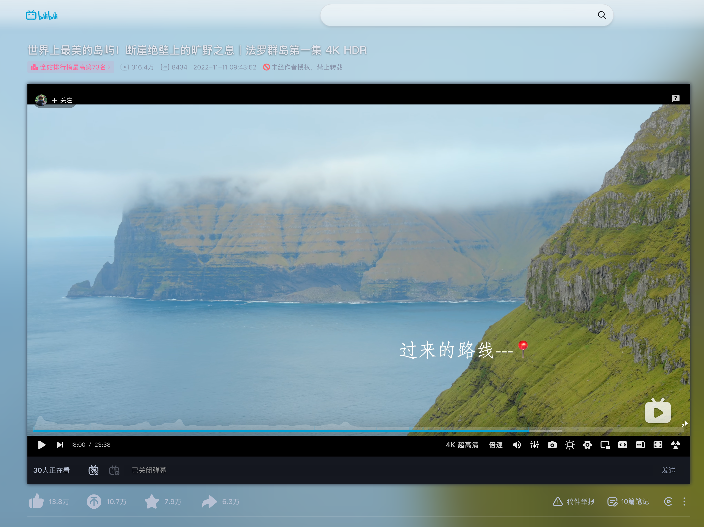

# Ambient light for Bilibili™

[English](README.md)

因为觉得 [Ambient light for YouTube™](https://github.com/WesselKroos/youtube-ambilight) 的视觉效果很好看，我把这种氛围光体验迁移到了哔哩哔哩，做成 **Ambient light for Bilibili™**。项目沿用其开源投射与渐隐算法，并针对 B 站播放器和页面布局做了适配。

让视频色彩延伸到播放器周围，向下浏览评论时也保留全页氛围光。适用于 Chrome 的 Manifest V3 扩展。

## 功能

- WebGL 实时投射，多层扩散与渐隐；GPU 不可用时降级为 Canvas 2D。
- 调节亮度、模糊、饱和度、颜色过渡、闪烁抑制；可选黑边检测和画面尺寸设置。
- 滚动评论区时铺满当前视口，暂停后保留最后一帧光效。
- 页首、侧栏、弹幕栏和评论输入框可独立融入背景，底部悬浮评论框使用半透明磨砂样式。
- 播放器齿轮左侧的屏幕图标打开紧凑中文菜单；支持普通、宽屏、网页全屏、全屏、小窗与镜像适配。
- 本地保存设置，支持 JSON 导入/导出，`Alt + Shift + A` 开关。

## 安装与更新

需要 Chrome 111 或更新版本。Chrome 扩展商店审核中。

1. 下载本仓库，或下载 Release 中的 `ambient-light-for-bilibili-1.0.0.zip` 并解压。
2. 打开 `chrome://extensions/`，启用「开发者模式」。
3. 点击「加载已解压的扩展程序」，选择 **`extension/` 文件夹**，即包含 `manifest.json` 的那一层。
4. 刷新 B 站视频页，点击播放器齿轮左侧的屏幕图标，或浏览器工具栏扩展图标。

请保留加载的文件夹。更新时覆盖旧文件，在扩展管理页重新加载扩展，再刷新 B 站页面；原设置保留。

## 致谢与许可证

MIT

参考 [WesselKroos/youtube-ambilight](https://github.com/WesselKroos/youtube-ambilight) 的投射、渐隐与 WebGL 色彩算法，以及 [iceorange-dev/bilibili-ambilight](https://github.com/iceorange-dev/bilibili-ambilight) 的 B 站播放器状态、页面融合和工具栏处理。
